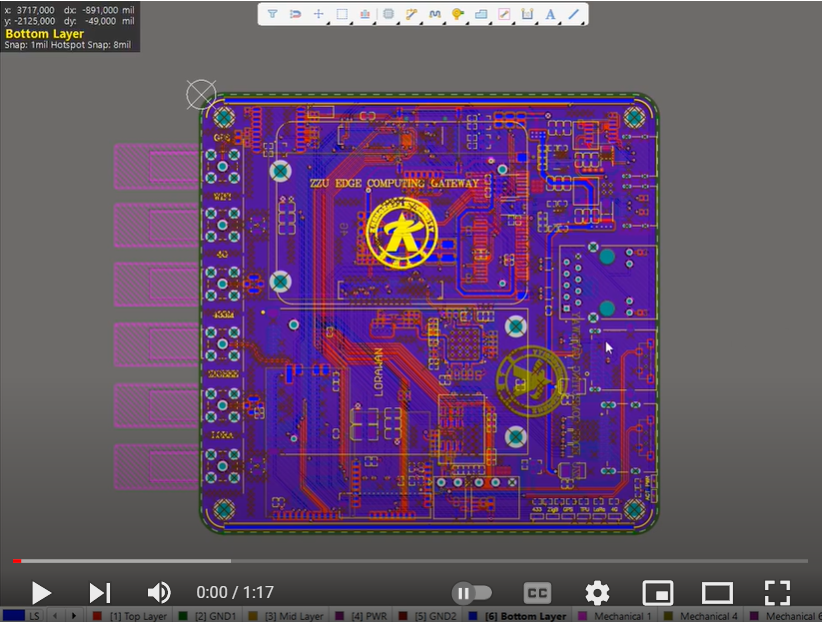

# ZZU EDGE COMPUTING GATEWAY
**Author**: 郑州大学物联网实验室， **E-mail**: bohao.chu@qq.com

## **INTRODUCTION**

我们基于CM4设计了一个物联网网关，携带了一个基于4TOPS算力的Google Coral TPU机器学习加速器, 可以实现边缘计算。

## **HARDWARE**

### **BOOM**

### **Power Management System**

### **Differential Pairs**

## 软件

