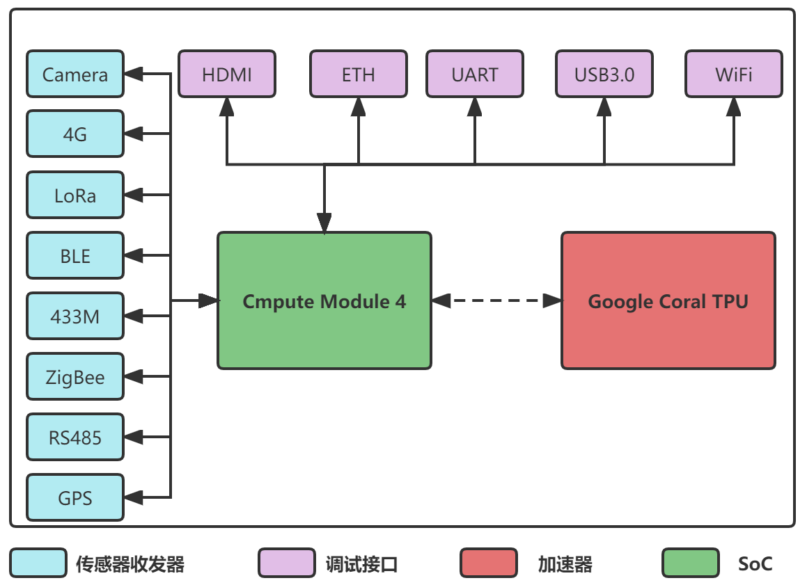

#  **Edge Computing Gateway** 
**Editor**: Bohao, **Email**: bohao.chu@qq.com

## 简介

边缘计算网关（ **E**dge **C**omputing **G**ateway，**ECG**），以下简称 **ECG**.

## 硬件

|4G|LoRa|TPU|ZigBee|433M|GPS|Camera|USB3|UART|ETH|WiFi|BLE|
|---|---|---|---|---|---|---|---|---|---|---|---|
|USB2.0|SPI|USB3.0|SPI|UART|UART|CSI|USB3.0|UART|-|-|-|

**ECG** 留出了12个的接口（存在复用）分给不同的硬件收发器和TPU，这些硬件收发器分为两大类，一类是传感器类（比如，通过 **LoRa** 收发器接受从 **LoRa** 节点发过来的信息，用通过 **GPS** 模块获取当前的地理坐标），一类是调试用（比如，通过 **UART** 打印输出信息，通过 **WiFi/ETH** 连接互联网，通过 **USB3.0** 连接鼠标/键盘）。

## 软件

1.  xxxx
2.  xxxx
3.  xxxx

## 案例

1.  xxxx
2.  xxxx
3.  xxxx

## 引用

1.  使用 Readme\_XXX.md 来支持不同的语言，例如 Readme\_en.md, Readme\_zh.md
2.  Gitee 官方博客 [blog.gitee.com](https://blog.gitee.com)
3.  你可以 [https://gitee.com/explore](https://gitee.com/explore) 这个地址来了解 Gitee 上的优秀开源项目
4.  [GVP](https://gitee.com/gvp) 全称是 Gitee 最有价值开源项目，是综合评定出的优秀开源项目
5.  Gitee 官方提供的使用手册 [https://gitee.com/help](https://gitee.com/help)
6.  Gitee 封面人物是一档用来展示 Gitee 会员风采的栏目 [https://gitee.com/gitee-stars/](https://gitee.com/gitee-stars/)

# ZZU EDGE COMPUTING GATEWAY
**Author**: 郑州大学物联网实验室， **E-mail**: bohao.chu@qq.com

## **INTRODUCTION**

我们基于CM4设计了一个物联网网关，携带了一个基于4TOPS算力的Google Coral TPU机器学习加速器, 可以实现边缘计算。

## **HARDWARE**

### **BOOM**

### **Power Management System**

### **Differential Pairs**

## 软件

